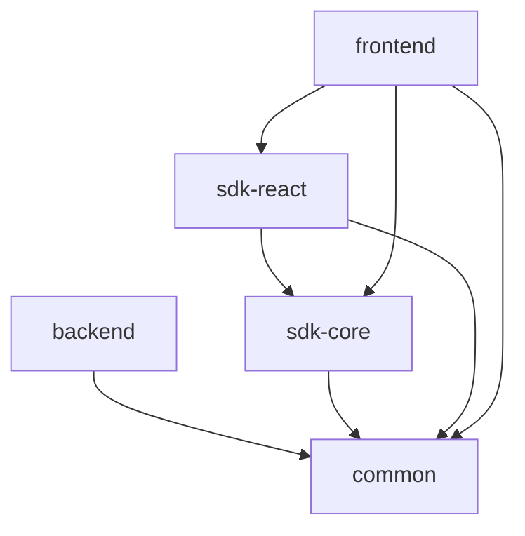

# Architecture

This repository is organized as a monorepo using [Bun](https://bun.sh/) workspaces and [Turborepo](https://turbo.build/) for build orchestration. It consists of the following workspaces:

## Workspaces

### common

Shared code and utilities used across all other workspaces. Contains on-chain types, datums, redeemers, helper functions, and common TypeScript types.

See the [common README](../common/README.md) for more details.

### backend

A Bun application that aggregates pool transactions from the Cardano blockchain using Ogmios, stores the data in a PostgreSQL database, and exposes it via tRPC endpoints.

See the [backend README](../backend/README.md) for more details.

### sdk/core

The core SDK library for interacting with Rapid DEX. Provides AMM math functions, transaction building utilities, a CLI tool, and a tRPC client for data fetching.

See the [sdk/core README](../sdk/core/README.md) for more details.

### sdk/react

A React-specific extension of the core SDK that provides React hooks, components, and React Query integration for building React applications with Rapid DEX.

See the [sdk/react README](../sdk/react/README.md) for more details.

### frontend

A Next.js application that provides the user interface for Rapid DEX, including wallet connection, pool creation, swaps, and liquidity management.

See the [frontend README](../frontend/README.md) for more details.

## Dependency Graph

The following diagram shows the modularized architecture:

